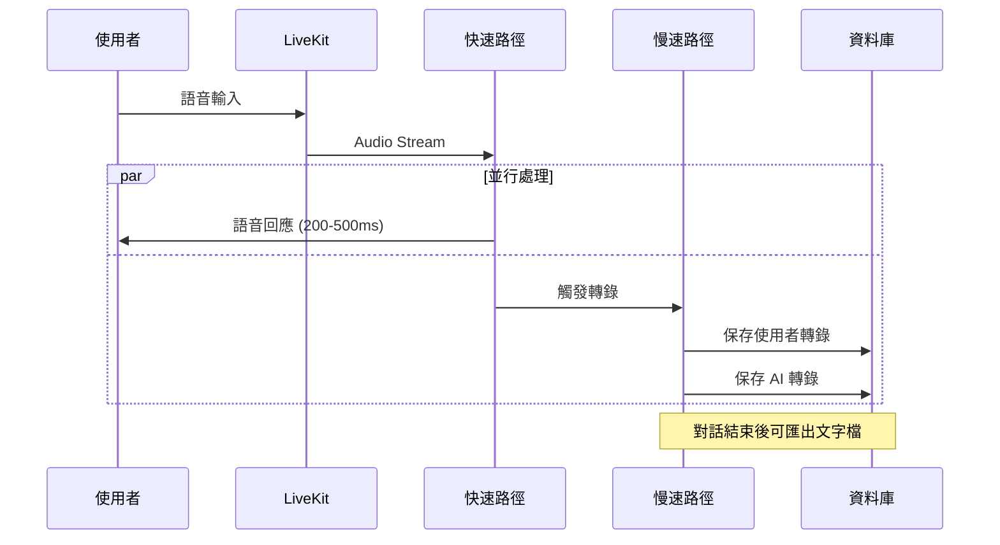

# Virtual Class Voice AI System

雙路徑語音 AI 系統：使用者透過語音與虛擬學生互動，系統同時執行快速語音回應和完整對話記錄。

## 🏗️ 系統架構

### 核心特色：雙路徑設計

1. **快速路徑（Fast Path）**
   - 使用 OpenAI Realtime API 進行 Speech-to-Speech
   - 延遲目標：200-500ms
   - 目的：提供最快的語音回應體驗

2. **慢速路徑（Slow Path）**
   - Whisper STT 進行高品質轉錄
   - 將使用者和 AI 的語音都轉換為文字
   - 完整對話記錄存入資料庫
   - 可匯出文字檔（Markdown/TXT）

### 技術棧

- **後端**: FastAPI + PostgreSQL
- **即時通訊**: LiveKit (WebRTC)
- **語音處理**: OpenAI Whisper (STT) + Azure Edge TTS
- **AI 協調**: LangGraph
- **LLM**: OpenAI GPT-4

## 📁 專案結構

```
virtual_class/
├── main.py                      # FastAPI 應用入口
├── models.py                    # SQLAlchemy 資料模型
├── database.py                  # 資料庫配置
├── .env.example                 # 環境變數範本
├── requirements.txt             # Python 依賴
│
├── api/                         # API 層
│   ├── auth.py                  # 認證端點
│   ├── session.py               # Session 管理
│   ├── report.py                # 報告匯出
│   └── livekit_token.py         # LiveKit Token 生成
│
├── core/                        # 核心模組
│   ├── auth_module.py           # JWT + LiveKit 認證
│   ├── session_manager.py       # Session 狀態管理
│   └── langgraph_coordinator.py # LangGraph 協調器
│
├── agents/                      # Agent 層
│   ├── prompts.py               # Agent Persona
│   ├── student_agent.py         # 虛擬學生 Agent
│   ├── expert_agent.py          # 專家評估 Agent
│   └── voice_pipeline.py        # 🔥 雙路徑語音 Pipeline
│
└── utils/                       # 工具層
    └── logger.py                # 對話記錄器
```

## 🚀 快速開始

### 1. 環境準備

```powershell
# 創建虛擬環境
python -m venv venv
venv\Scripts\activate

# 安裝依賴
pip install -r requirements.txt
```

### 2. 配置環境變數

```powershell
# 複製環境變數範本
copy .env.example .env

# 編輯 .env 填入你的 API Keys
# - DATABASE_URL
# - OPENAI_API_KEY
# - LIVEKIT_API_KEY
# - LIVEKIT_API_SECRET
# - JWT_SECRET_KEY
```

### 3. 啟動 PostgreSQL 資料庫

```powershell
# 使用 Docker（推薦）
docker run --name virtual-class-db -e POSTGRES_PASSWORD=password -e POSTGRES_DB=virtual_class -p 5432:5432 -d postgres:15

# 或安裝本地 PostgreSQL
```

### 4. 啟動 LiveKit Server

```powershell
# 使用 Docker
docker run --rm -p 7880:7880 -p 7881:7881 -p 7882:7882/udp livekit/livekit-server --dev

# 或下載 LiveKit binary
```

### 5. 初始化資料庫並啟動 FastAPI

```powershell
# 啟動 FastAPI Server
python main.py

# API 將運行於 http://localhost:8000
# API 文件: http://localhost:8000/docs
```

### 6. 啟動 LiveKit Worker（語音 Pipeline）

```powershell
# 在另一個終端啟動
python agents/voice_pipeline.py dev
```

## 📝 API 使用流程

### 1. 註冊 / 登入

```bash
# 註冊
curl -X POST "http://localhost:8000/auth/register" \
  -H "Content-Type: application/json" \
  -d '{"username": "teacher1", "email": "teacher@example.com", "password": "password123"}'

# 登入（獲取 JWT token）
curl -X POST "http://localhost:8000/auth/login" \
  -H "Content-Type: application/json" \
  -d '{"username": "teacher1", "password": "password123"}'
```

### 2. 創建 Session

```bash
curl -X POST "http://localhost:8000/session/create" \
  -H "Authorization: Bearer YOUR_JWT_TOKEN" \
  -H "Content-Type: application/json" \
  -d '{"title": "My First Teaching Session"}'
```

### 3. 獲取 LiveKit Token

```bash
curl -X POST "http://localhost:8000/livekit/token" \
  -H "Authorization: Bearer YOUR_JWT_TOKEN" \
  -H "Content-Type: application/json" \
  -d '{"session_uuid": "YOUR_SESSION_UUID"}'
```

### 4. 連線到 LiveKit（前端）

使用返回的 `token` 和 `url` 連線到 LiveKit 房間，開始語音互動。

### 5. 下載對話記錄

```bash
# Markdown 格式
curl -X GET "http://localhost:8000/report/YOUR_SESSION_UUID/transcript?format=markdown" \
  -H "Authorization: Bearer YOUR_JWT_TOKEN" \
  --output transcript.md

# TXT 格式
curl -X GET "http://localhost:8000/report/YOUR_SESSION_UUID/transcript?format=txt" \
  -H "Authorization: Bearer YOUR_JWT_TOKEN" \
  --output transcript.txt
```

## 🔧 開發指南

### 資料庫遷移（使用 Alembic）

```powershell
# 初始化 Alembic
alembic init alembic

# 創建遷移
alembic revision --autogenerate -m "Initial migration"

# 執行遷移
alembic upgrade head
```

### 測試語音 Pipeline

```powershell
# 啟動 Worker 並查看日誌
python agents/voice_pipeline.py dev --log-level debug
```

## 🎯 系統運作流程



## 📚 關鍵檔案說明

### `agents/voice_pipeline.py` - 雙路徑 Pipeline 核心

這是整個系統最關鍵的檔案，實作了：
- **快速路徑**: `setup_fast_path()` 使用 LiveKit VoicePipelineAgent
- **慢速路徑**: `_slow_path_user_transcription()` 和 `_slow_path_agent_transcription()`
- **並行執行**: 使用 `asyncio.create_task()` 確保兩條路徑同時運行

### `core/langgraph_coordinator.py` - 場景協調

使用 LangGraph 管理 Student Agent 和 Expert Agent 的狀態機，決定何時調用哪個 Agent。

## 🐛 常見問題

### Q: LiveKit 連線失敗？
A: 確認 LiveKit Server 已啟動，並檢查 `.env` 中的 `LIVEKIT_URL` 配置。

### Q: 語音回應延遲太高？
A: 檢查：
1. OpenAI Realtime API 是否可用
2. 網路連線品質
3. LiveKit Server 是否與應用在同一區域

### Q: 轉錄文字不完整？
A: 慢速路徑是異步的，確保在結束 session 前等待所有轉錄完成。

## 📄 授權

MIT License

## 🤝 貢獻

歡迎提交 Issue 和 Pull Request！

---

**開發團隊**: Virtual Class AI Team  
**聯絡方式**: support@virtualclass.ai
